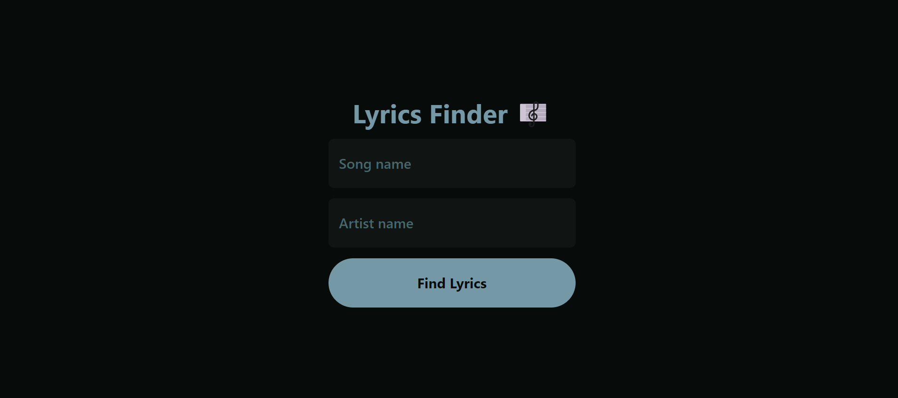
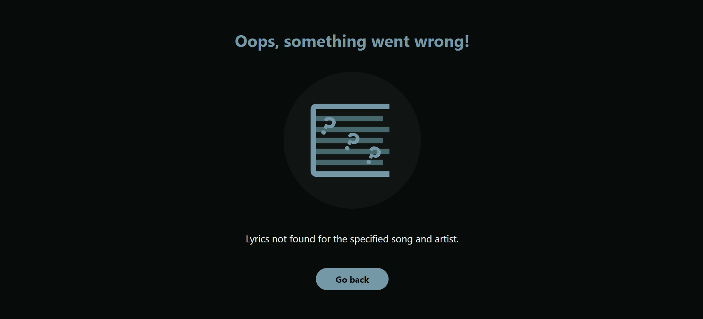

# Lyrics Finder

This is a simple React application that allows users to find the lyrics of their favorite songs by entering the artist's name and the song title. The app uses the [Lyrics.ovh API](https://lyricsovh.docs.apiary.io/#) to fetch lyrics.

# Features

- **Search Lyrics:** Users can input the name of the artist and the song to search for lyrics.
- **Display Lyrics:** The app displays the fetched lyrics in a user-friendly format.
- **Navigation:** The app uses React Router for navigation between the home page and the lyrics display page.

# Future Improvements

- Add error handling for API requests. ✅
- Add loading indicators while fetching lyrics.
- Improve UI/UX design.
- Add responsive design. ✅

## Screenshots

## Authors

- Developed and designed by: [@mdurando](https://twitter.com/ingeaeri)
